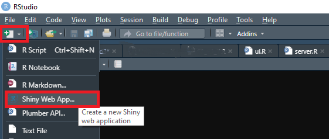
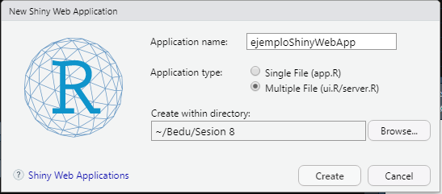
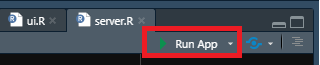

# Ejemplo 01. Ambiente de trabajo UI y Server

#### Objetivo
- Entender el entorno de trabajo con la libreria `Shiny`
- Funciones básicas de la UI y del Server
- Presentar gráficas de dispersión en una webApp

#### Requisitos
- Tener instalada y cargada la libreria `Shiny`
- Desarrollar y entender el prework
- conocimiento de funciones como `paste` y `plot` 

#### Desarollo

Durante esta sesión serás capaz de realizar una webApp con el uso de la libreria de `Shiny`, está es útil para presentar reportes. 

Lo primero que se debe hacer es generar un arhivo Shiny Web App en RStudio

Hay que colocar un nombre de nuestra Web App, además de seleccionar multiple file (esto creará dos archivos ui.R y server.R) y la ruta donde se almacenará 

Una vez hecho esto, tendremos los dos archivos creados, en el UI (User interface), se establece la visualización de nuestro Dashboar o reporte, y en el Serve se establecen las variables de entrada y salida. Para ejecutar la Web App con dar clic en `Run App` bastará.

